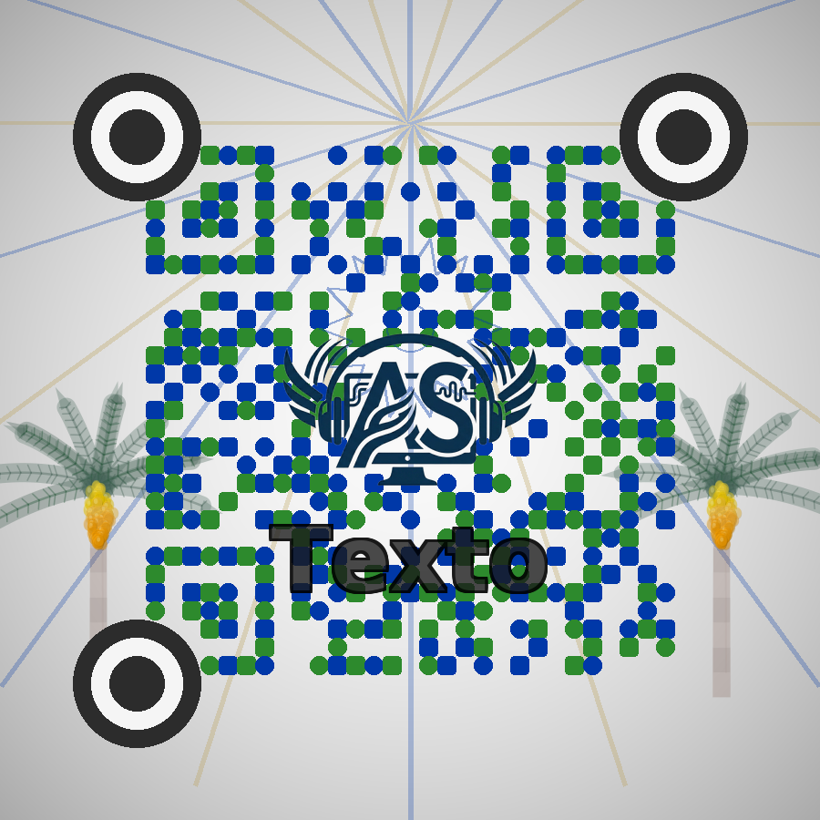

# 🌴 Generador QR Personalizado

QR artístico generado con Python: colores personalizables, palmeras Butiá dibujadas con geometría vectorial, texto, logo incrustado en el centro y verificación de contraste WCAG automática.

<div align="center">



*QR funcional con logo personalizado, palmeras decorativas y módulos bicolores*

</div>

---

## 💡 ¿Por qué esto existe?

Un QR genérico en blanco y negro no transmite identidad. Este generador nació para crear QRs que sean **parte del diseño** — con los colores de tu marca, tu logo en el centro y decoraciones que lo hacen único.

El desafío técnico fue lograr que el QR sea **visualmente llamativo y siga siendo escaneable** — dos objetivos que se contradicen si no se manejan bien. La solución está en usar corrección de error nivel H (30%) y controlar la opacidad de cada capa decorativa.

---

## ✨ Qué hace el generador

- 🎨 **Módulos QR bicolores** — dos colores alternados configurables
- 🌅 **Fondo con gradiente radial** e irradiación solar (rayos decorativos)
- 🌴 **Palmeras Butiá dibujadas con geometría vectorial** via `cairocffi` — tronco, hojas, racimo de 65 frutos en distribución esférica de 3 capas con brillo y sombras
- 🔘 **Ojos del QR circulares** (en lugar de los cuadrados estándar)
- 🏷️ **Texto personalizable** tipografiado sobre el QR
- 🖼️ **Logo incrustado en el centro** (aprovecha la corrección de error H del estándar QR)
- 📊 **Métricas de calidad automáticas**: contraste WCAG 2.0, verificación de escaneabilidad, cumplimiento AA/AAA

---

## 🛠️ Librerías utilizadas

| Librería | Uso |
|---|---|
| `qrcode` | Generación de la matriz QR con corrección de error alta (H) |
| `Pillow (PIL)` | Composición de imágenes, gradientes, texto y capas RGBA |
| `numpy` | Gradiente radial y cálculos de luminancia WCAG |
| `cairocffi` | Dibujo vectorial de las palmeras (tronco, hojas, frutos) |
| `pyzbar` | Validación de escaneabilidad del QR generado *(opcional)* |

> `cairocffi` y `pyzbar` son opcionales — si no están instalados, el script igual funciona sin las palmeras y sin validación automática.

---

## 🚀 Cómo usarlo

### 1. Clonar el repositorio

```bash
git clone https://github.com/tu-usuario/qr-personalizado.git
cd qr-personalizado
```

### 2. Instalar dependencias

```bash
pip install qrcode pillow numpy
# Opcionales (palmeras + validación):
pip install cairocffi pyzbar
```

### 3. Ejecutar

```bash
# Uso básico
python generarQR.py https://tu-sitio.com/ "Tu Texto"

# Solo URL (texto por defecto: "Texto")
python generarQR.py https://tu-sitio.com/
```

El QR se guarda en `output/qr_personalizado.png` a 300 DPI, listo para imprimir.

### 4. Personalizar colores y logo

Para cambiar los colores institucionales o el logo, editá las constantes al inicio de la clase `GeneradorQROptimizado` en `generarQR.py`:

```python
# Colores (formato hex)
AZUL_INSTITUCIONAL = "#0038A8"   # Color principal de los módulos
VERDE_BUTIA        = "#2d8a2d"   # Color secundario de los módulos

# Logo (ruta relativa al script)
LOGO = "logos/tu_logo.png"       # Cambiá esto por tu logo
```

---

## 📁 Estructura del proyecto

```
qr-personalizado/
├── generarQR.py          # Script principal
├── qr_personalizado.png  # Ejemplo de salida
├── logos/
│   └── logo_ejemplo.png  # Logo usado en el ejemplo
└── output/               # Carpeta de salida (se crea automáticamente)
```

---

## 📊 Métricas del ejemplo generado

- **Contraste WCAG 2.0**: calculado automáticamente al generar
- **Corrección de error**: nivel H (30%) — permite que el logo cubra hasta un 30% del QR sin romper la lectura
- **Resolución de salida**: 300 DPI
- **Frutos en el racimo**: 65, distribuidos en 3 capas esféricas

---

## 🎨 Personalización avanzada

Todos los parámetros de las decoraciones se controlan desde el diccionario `config` dentro de `_obtener_config_variante()`:

| Parámetro | Descripción | Valor por defecto |
|---|---|---|
| `palmas_opacidad` | Transparencia de las palmeras (0–1) | `0.35` |
| `palmas_cantidad` | Número de palmeras (0, 1 o 2) | `2` |
| `irradiacion_rayos` | Cantidad de rayos del sol decorativo | `20` |
| `irradiacion_opacidad` | Transparencia de los rayos (0–1) | `0.30` |
| `texto_escala` | Tamaño del texto relativo al QR | `0.6` |

---

## 📝 Notas

El QR del ejemplo fue generado a partir de un proyecto de rediseño web. Para adaptarlo a cualquier contexto, solo cambiás la URL, el logo y los colores — el resto del pipeline (gradiente, palmeras, métricas) funciona igual.
